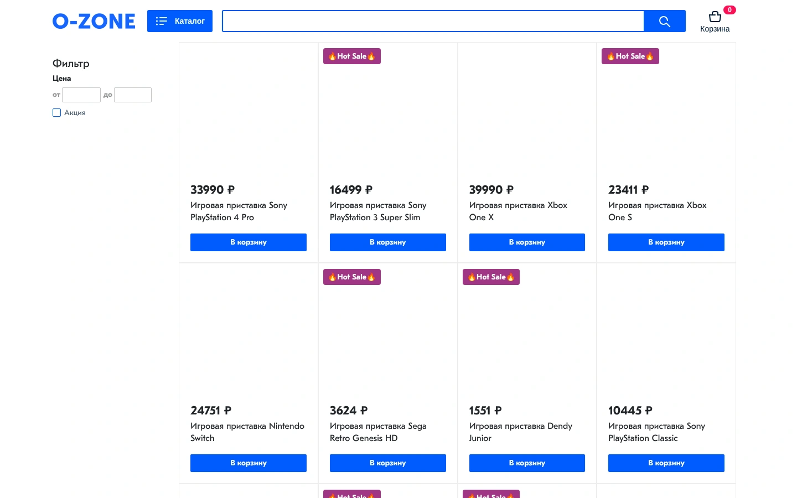
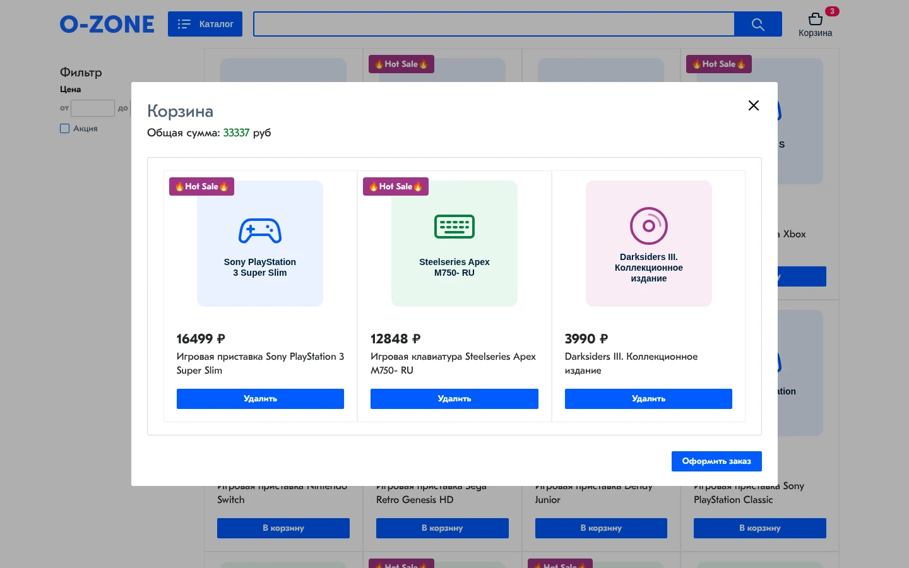

# webpack-ozon

> 🎓 **Учебный проект (ноябрь 2025).** Интернет-магазин «Ozon» за 4 дня на интенсиве GloAcademy. Вёрстка и логика написаны по ходу занятий, коммиты `Day 1`–`Day 4` соответствуют дням интенсива. Позже я настроила сборку, перевела данные на локальный JSON, заменила недоступные фото товаров заглушками и написала этот README.

Витрина магазина без фреймворка: товары рендерятся из JSON, есть поиск, категории, фильтр по цене и корзина. Для меня это пример того, как собрать вёрстку на vanilla JS и SCSS через Webpack.

**Демо:** https://barbarafromtonshaevo.github.io/webpack-ozon/

## Что умеет

- **Каталог.** 28 товаров из `db/db.json` выводятся карточками, у товаров по акции есть плашка «Hot Sale».
- **Поиск** по названию срабатывает при вводе, регистр не важен.
- **Категории.** Кнопка «Каталог» открывает меню из трёх категорий.
- **Фильтр** по цене «от / до» и чекбокс «Акция». На экранах от 992 px фильтр в боковой колонке, на мобильных он скрыт.
- **Корзина.** Товары можно добавлять и удалять, счётчик в шапке и общая сумма пересчитываются. Корзина хранится в `localStorage` и переживает перезагрузку страницы. «Оформить заказ» отправляет POST на тестовый API [jsonplaceholder](https://jsonplaceholder.typicode.com/) и очищает корзину.

## Стек

| | |
| --- | --- |
| Разметка | HTML, Bootstrap 4 (сетка, с CDN) |
| Стили | SCSS (вложенность, БЭМ-подобные `&-` / `&_` селекторы), шрифт GT Eesti Pro |
| Логика | JavaScript (ES-модули), `fetch`, `localStorage` |
| Сборка | Webpack 5, webpack-dev-server, sass, html-loader, copy-webpack-plugin |
| Деплой | GitHub Actions → GitHub Pages |

## Структура

```
index.html            шаблон страницы (скрипты и стили вставляет webpack)
scss/style.scss       все стили
src/index.js          точка входа: подключает SCSS и запускает модули
src/modules/
  getData.js          загрузка товаров из db/db.json
  load.js             первичный рендер каталога
  renderGoods.js      карточки товаров
  search.js           поиск
  catalog.js          меню категорий
  filter.js           цена и «Акция»
  filters.js          чистые функции фильтрации
  cart.js             корзина: добавление, удаление, заказ
  renderCart.js       карточки в корзине
  postData.js         отправка заказа
db/db.json            данные товаров
img/goods/            SVG-заглушки вместо фото товаров (по id товара)
fonts/, img/, favicon/
```

## Сборка

Конфиг лежит в [`webpack.config.js`](./webpack.config.js). Он экспортирует функцию, которая получает режим (`--mode development` или `production`) и настраивает под него хеши, source maps и `publicPath`.

**Как проходит сборка.** Точка входа `src/index.js` импортирует и модули, и `scss/style.scss`, поэтому webpack видит весь проект как один граф зависимостей. Из этого графа получаются три вида файлов: JS-бандл, отдельный CSS и ассеты (шрифты, картинки, JSON с товарами). В конце HtmlWebpackPlugin вставляет в `index.html` ссылки на всё собранное.

### Лоадеры

Лоадер превращает файл, который не является JS, в модуль, понятный webpack.

| Правило | Что делает и зачем |
| --- | --- |
| `sass-loader` | Компилирует SCSS в CSS пакетом `sass` (Dart Sass). Раньше этим занимался Live Sass Compiler в редакторе, и собранный CSS лежал в репозитории. Теперь SCSS собирается той же командой, что и JS |
| `css-loader` | Разбирает CSS и превращает `url(...)` и `@import` в зависимости. Благодаря этому `url("../fonts/…OTF")` и `url("../img/logo.png")` из SCSS попадают в сборку, и в CSS подставляется итоговый путь |
| `MiniCssExtractPlugin.loader` | Выносит CSS в отдельный файл `css/main.css`, а не встраивает его в JS. Так стили грузятся параллельно со скриптом и страница не мигает без оформления |
| `html-loader` | Разбирает шаблон `index.html` и отправляет фавиконки и манифест из `<link>` через webpack. Без него пришлось бы копировать папку `favicon/` вручную |
| `asset/resource` для картинок, шрифтов, `.webmanifest` | Встроенные в Webpack 5 asset modules, отдельные `file-loader` / `url-loader` больше не нужны. Файл копируется в `dist/`, в код подставляется его URL. У шрифтов своя папка `fonts/`. В регулярном выражении стоит флаг `/i`, потому что файлы шрифтов называются `.OTF` |

Цепочка `use: [MiniCssExtractPlugin.loader, 'css-loader', 'sass-loader']` выполняется **справа налево**: sass → css → отдельный файл.

### Плагины

| Плагин | Зачем |
| --- | --- |
| `HtmlWebpackPlugin` | Берёт `index.html` как шаблон и сам добавляет `<link>` на CSS и `<script defer>` на JS с правильными именами. В prod имена файлов содержат хеш, и прописать их руками нельзя |
| `MiniCssExtractPlugin` | Работает вместе со своим лоадером и записывает собранный CSS в файл |
| `CssMinimizerPlugin` | Сжимает CSS в prod. В `optimization.minimizer` стоит `'...'`: это значит «оставить минимизаторы по умолчанию», то есть Terser для JS. Без `'...'` JS перестал бы минифицироваться |
| `CopyPlugin` | Копирует `img/goods/` в `dist/` как есть. Пути к картинкам товаров записаны строками в `db.json`, и webpack о них не знает: в граф зависимостей они не попадают. Поэтому файлы копируются без хешей, иначе пути из JSON перестали бы совпадать |

### Режимы dev и prod

| | `npm run dev` | `npm run build` |
| --- | --- | --- |
| Source maps | `source-map`: в DevTools видны исходные JS-модули и строки SCSS | нет |
| Минификация | нет | JS (Terser) и CSS (cssnano) |
| Имена файлов | `js/main.js` | `js/main.3f9a1c2e.js`: хеш содержимого меняется только при изменении файла, поэтому браузер может кешировать надолго и не держит старую версию |
| `publicPath` | `/` | `/webpack-ozon/` |
| Где результат | в памяти dev-server, с автообновлением | папка `dist/` |

**Почему `publicPath` именно такой.** GitHub Pages отдаёт проектный репозиторий не из корня домена, а из подпапки `/webpack-ozon/`. Если оставить `/`, браузер будет искать шрифты по адресу `barbarafromtonshaevo.github.io/fonts/…` и получит 404. По той же причине ссылка на логотипе ведёт на `./`, а не на `/`.

### Данные

Firebase-база интенсива теперь отвечает `401`, поэтому товары лежат в `db/db.json`. В `getData.js` адрес файла задан как

```js
new URL('../../db/db.json', import.meta.url)
```

Webpack распознаёт такую конструкцию и копирует JSON в `dist/assets/db.[hash].json` как отдельный статический файл, не вшивая его в бандл. Код по-прежнему загружает данные через `fetch`, как было с Firebase. Остальные модули не изменились.

**Картинки товаров.** В оригинальных данных фото брались с CDN Ozon (`cdn1.ozone.ru/multimedia/…`), но эти адреса больше не открываются. Вместо них в `img/goods/` лежат SVG-заглушки по одной на товар: цвет категории, иконка типа товара и короткое название модели. Каждая весит меньше 1 КБ. В `db.json` поле `img` теперь содержит относительный путь (`img/goods/0.svg`), а неиспользуемое поле `hoverImg` с мёртвыми ссылками удалено. Код рендера не менялся: он по-прежнему подставляет `img` в `background-image`.

## Как запустить

Нужен Node.js 22.15+ (этого требуют webpack-dev-server 6 и sass-loader 17).

```bash
git clone https://github.com/BarbaraFromTonshaevo/webpack-ozon.git
cd webpack-ozon
npm ci
npm run dev      # dev-server на http://localhost:8080 с автообновлением
npm run build    # продакшен-сборка в dist/
```

Открыть `dist/index.html` двойным кликом не получится: пути в сборке начинаются с `/webpack-ozon/`, а `fetch` не работает по `file://`. Чтобы посмотреть prod-сборку локально, её нужно раздать из папки, в которой `dist` лежит под именем `webpack-ozon`:

```bash
mkdir -p /tmp/preview && ln -sfn "$PWD/dist" /tmp/preview/webpack-ozon
python3 -m http.server 8000 -d /tmp/preview   # → http://localhost:8000/webpack-ozon/
```

## Деплой

При каждом пуше в `main` workflow [`.github/workflows/deploy.yml`](./.github/workflows/deploy.yml) ставит зависимости через `npm ci` по `package-lock.json`, запускает `npm run build` и публикует `dist/` на GitHub Pages.

Я выбрала GitHub Actions, а не пакет `gh-pages`, по трём причинам: собранные файлы не хранятся ни в одной ветке, сборка всегда идёт из того, что лежит в `main`, а не с моего компьютера, и отдельная команда `deploy` не нужна.

## Скриншоты

**Каталог и корзина на десктопе**

<p>
  
  
</p>

**Мобильная версия** (390 × 844)

<p>
  
  
</p>

## Что бы я сделала иначе сейчас

Код интенсива я оставила почти как есть. Изменения коснулись только загрузки данных и подключения к сборке. Вот что я бы переделала:

- **Фильтры не складываются.** Поиск, категория и фильтр по цене каждый раз начинают с полного списка товаров. Если выбрать «Периферия для ПК», а потом ввести цену, категория сбрасывается. Правильнее хранить одно состояние (`{ query, category, min, max, sale }`) и прогонять товары через все фильтры сразу.
- **Данные загружаются заново на каждое нажатие клавиши.** `getData()` вызывается при каждом `input`. С локальным файлом это незаметно, но достаточно загрузить товары один раз и держать их в памяти.
- **Счётчик в шапке не обнуляется после «Оформить заказ»** и сбрасывается только после перезагрузки страницы. Кроме того, заказ можно отправить из пустой корзины.
- **Граничные цены не попадают в фильтр.** Условия `>` и `<` вместо `>=` и `<=`: при фильтре «от 3624» товар за 3624 ₽ не показывается.
- **Нет обработки ошибок и состояния загрузки.** Если данные не пришли, страница просто остаётся пустой. Именно так она и выглядела, когда Firebase начал отвечать 401.
- **Разметка через `innerHTML` в шаблонных строках.** Для учебных данных это допустимо, но с настоящими данными нужны экранирование или `textContent` / `<template>`.
- **Внешние зависимости.** Bootstrap подключён целиком с CDN ради сетки, хотя хватило бы CSS Grid. Фото товаров брались с чужого CDN по прямым ссылкам. Когда ссылки перестали работать, у всех карточек пропали картинки, поэтому теперь вместо них заглушки. Для настоящего магазина изображения стоит хранить у себя.
- **Мелочи вёрстки.** Иконка закрытия корзины чёрная, потому что в SVG написано `fill='005bff'` без `#`. Шрифт `GTEestiProDisplay` используется, но не подключён. `Medium`-начертание лежит в `fonts/` и нигде не используется. Манифест фавиконок пустой, пути в нём от корня домена. Фильтр на мобильных просто скрыт.
- **Доступность.** Каталог сделан на `<li>` с обработчиком клика, а корзина открывается ссылкой `href="#"`. Такие элементы недоступны с клавиатуры, у поля поиска нет `label`, а у модального окна нет фокус-ловушки и закрытия по Esc.
