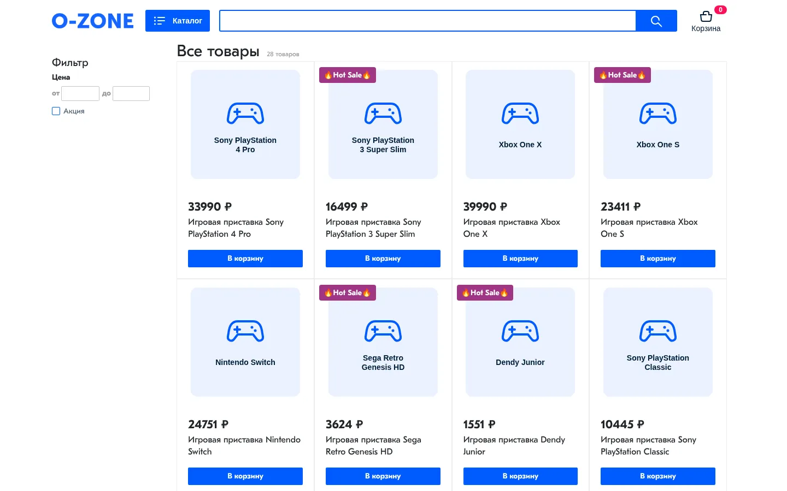
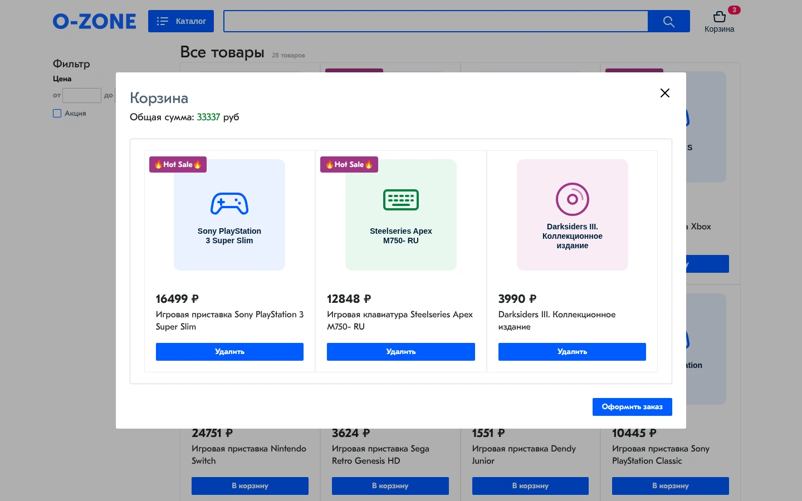

# webpack-ozon

**English** | [Русский](README.ru.md)

> 🎓 **Training project (November 2025).** An "Ozon" online store built in 4 days during a GloAcademy intensive. The markup and logic were written along with the lessons, and the `Day 1`–`Day 4` commits match the days of the course. Afterwards I set up the build, moved the data to a local JSON file, replaced unavailable product photos with placeholders, reworked the filters and the category menu, and wrote this README.

A framework-free storefront: products are rendered from JSON, with search, categories, a price filter and a cart. For me it is an example of bundling a vanilla JS + SCSS page with Webpack. The UI is in Russian.

**Live demo:** https://barbarafromtonshaevo.github.io/webpack-ozon/

## Screenshots

**Catalog and cart on desktop**

<p>
  
  
</p>

**Mobile** (390 × 844)

<p>
  
  
</p>

## Features

- **Catalog.** 28 products from `db/db.json` are rendered as cards; discounted items get a "Hot Sale" badge.
- **Search** by product name, updated as you type and case-insensitive.
- **Categories.** The «Каталог» (Catalog) button opens a menu with "All products" and three categories. The selected item is highlighted, and the menu works with the keyboard.
- **Filter** by price (from / to) and an «Акция» (On sale) checkbox. On screens 992 px and wider the filter sits in a sidebar; on mobile it is hidden.
- **All filters work together.** Search, category, price and the sale checkbox are applied at the same time. A heading above the grid shows the current category and how many products match (e.g. «Периферия для ПК · 3 товара», "PC peripherals · 3 items"). If nothing matches, a hint is shown instead of the cards.
- **Cart.** Items can be added and removed; the header counter and the total update accordingly. The cart is stored in `localStorage` and survives a page reload. «Оформить заказ» (Place order) sends a POST request to the [jsonplaceholder](https://jsonplaceholder.typicode.com/) test API and clears the cart.

## Tech stack

| | |
| --- | --- |
| Markup | HTML, Bootstrap 4 (grid only, from a CDN) |
| Styles | SCSS (nesting, BEM-like `&-` / `&_` selectors), GT Eesti Pro font |
| Logic | JavaScript (ES modules), `fetch`, `localStorage` |
| Build | Webpack 5, webpack-dev-server, sass, html-loader, copy-webpack-plugin |
| Deployment | GitHub Actions → GitHub Pages |

## Project structure

```
index.html            page template (webpack injects the scripts and styles)
scss/style.scss       all styles
src/index.js          entry point: imports the SCSS and starts the modules
src/modules/
  getData.js          loads products from db/db.json
  load.js             initial catalog render
  renderGoods.js      product cards and the "nothing found" message
  changeInfo.js       heading above the grid: category and item count
  state.js            shared filter state and applyFilters()
  search.js           search
  catalog.js          category menu
  filter.js           price and "on sale" filter
  filters.js          pure filter functions
  cart.js             cart: add, remove, place order
  renderCart.js       cards inside the cart
  postData.js         sends the order
db/db.json            product data
img/goods/            SVG placeholders instead of product photos (one per product id)
fonts/, img/, favicon/
```

## Build setup

The config lives in [`webpack.config.js`](./webpack.config.js). It exports a function that receives the mode (`--mode development` or `production`) and sets content hashes, source maps and `publicPath` accordingly.

**How the build works.** The entry point `src/index.js` imports both the JS modules and `scss/style.scss`, so webpack sees the whole project as one dependency graph. The graph produces three kinds of output: a JS bundle, a separate CSS file, and assets (fonts, images, the products JSON). Finally, HtmlWebpackPlugin injects links to everything into `index.html`.

### Loaders

A loader turns a non-JS file into a module webpack can understand.

| Rule | What it does and why |
| --- | --- |
| `sass-loader` | Compiles SCSS to CSS with the `sass` package (Dart Sass). This used to be done by the Live Sass Compiler editor extension, and the compiled CSS was committed to the repo. Now SCSS is built by the same command as the JS |
| `css-loader` | Parses the CSS and turns `url(...)` and `@import` into dependencies. That is how `url("../fonts/…OTF")` and `url("../img/logo.png")` from the SCSS get into the build, with the final path substituted in the CSS |
| `MiniCssExtractPlugin.loader` | Extracts CSS into a separate `css/main.css` file instead of embedding it in the JS. Styles then load in parallel with the script, and the page doesn't flash unstyled |
| `html-loader` | Parses the `index.html` template and passes the favicons and manifest from `<link>` tags through webpack. Without it the `favicon/` folder would have to be copied by hand |
| `asset/resource` for images, fonts, `.webmanifest` | Webpack 5's built-in asset modules; separate `file-loader` / `url-loader` are no longer needed. The file is copied to `dist/` and its URL is substituted in the code. Fonts get their own `fonts/` folder. The regex has the `/i` flag because the font files use an upper-case `.OTF` extension |

The chain `use: [MiniCssExtractPlugin.loader, 'css-loader', 'sass-loader']` runs **right to left**: sass → css → separate file.

### Plugins

| Plugin | Why |
| --- | --- |
| `HtmlWebpackPlugin` | Uses `index.html` as a template and adds the CSS `<link>` and the `<script defer>` with the correct file names. In production the names contain a hash, so they can't be written by hand |
| `MiniCssExtractPlugin` | Works together with its loader and writes the compiled CSS to a file |
| `CssMinimizerPlugin` | Minifies CSS in production. `optimization.minimizer` includes `'...'`, which means "keep the default minimizers", i.e. Terser for JS. Without `'...'` the JS would no longer be minified |
| `CopyPlugin` | Copies `img/goods/` to `dist/` as is. The product image paths are plain strings in `db.json`, so webpack doesn't know about them and they are not part of the dependency graph. That is why the files are copied without hashes: otherwise the paths in the JSON would stop matching |

### Dev and production modes

| | `npm run dev` | `npm run build` |
| --- | --- | --- |
| Source maps | `source-map`: DevTools shows the original JS modules and SCSS lines | none |
| Minification | none | JS (Terser) and CSS (cssnano) |
| File names | `js/main.js` | `js/main.3f9a1c2e.js`: the content hash changes only when the file changes, so browsers can cache it long-term without serving a stale version |
| `publicPath` | `/` | `/webpack-ozon/` |
| Output | in dev-server memory, with live reload | the `dist/` folder |

**Why this `publicPath`.** GitHub Pages serves a project repository from the `/webpack-ozon/` subfolder, not from the domain root. With `/`, the browser would look for fonts at `barbarafromtonshaevo.github.io/fonts/…` and get a 404. For the same reason the logo links to `./` rather than `/`.

### Data

The Firebase database used in the intensive now responds with `401`, so the products live in `db/db.json`. In `getData.js` the file URL is defined as

```js
new URL('../../db/db.json', import.meta.url)
```

Webpack recognizes this pattern and copies the JSON to `dist/assets/db.[hash].json` as a separate static file instead of inlining it into the bundle. The code still loads the data with `fetch`, just as it did with Firebase, and the other modules didn't change.

**Product images.** The original data pointed to photos on the Ozon CDN (`cdn1.ozone.ru/multimedia/…`), but those URLs no longer work. Instead, `img/goods/` holds one SVG placeholder per product: the category color, an icon for the product type and a short model name. Each is under 1 KB. The `img` field in `db.json` now holds a relative path (`img/goods/0.svg`), and the unused `hoverImg` field with dead links was removed. The rendering code is unchanged: it still puts `img` into `background-image`.

## Getting started

Requires Node.js 22.15+ (needed by webpack-dev-server 6 and sass-loader 17).

```bash
git clone https://github.com/BarbaraFromTonshaevo/webpack-ozon.git
cd webpack-ozon
npm ci
npm run dev      # dev server at http://localhost:8080 with live reload
npm run build    # production build into dist/
```

Double-clicking `dist/index.html` won't work: paths in the build start with `/webpack-ozon/`, and `fetch` doesn't work over `file://`. To preview the production build locally, serve it from a folder where `dist` is available under the name `webpack-ozon`:

```bash
mkdir -p /tmp/preview && ln -sfn "$PWD/dist" /tmp/preview/webpack-ozon
python3 -m http.server 8000 -d /tmp/preview   # → http://localhost:8000/webpack-ozon/
```

## Deployment

On every push to `main`, the [`.github/workflows/deploy.yml`](./.github/workflows/deploy.yml) workflow installs dependencies with `npm ci` from `package-lock.json`, runs `npm run build` and publishes `dist/` to GitHub Pages.

I chose GitHub Actions over the `gh-pages` package for three reasons: build output isn't stored in any branch, the site is always built from what is in `main` rather than from my machine, and there's no separate `deploy` command to remember.

## What I improved after the intensive

- **Filters now combine.** In the course version, search, category and price each started from the full product list: pick "PC peripherals", then enter a price, and the category was lost. Now `state.js` holds a single state object `{ query, category, min, max, sale }`. Each module updates its own field, and `applyFilters()` runs the products through all filters at once.
- **Category menu.** It used to be `<li>` elements with click handlers: unreachable by keyboard, with no way back to all products. Now these are `<button>` elements with `data-category` and `aria-pressed`, there is an "All products" item, the selected category is highlighted, and the menu closes after a choice.
- **You can see where you're searching.** The heading above the grid shows the current category and the number of matches, with correct Russian plural forms via `Intl.PluralRules` («1 товар», «3 товара», «28 товаров»). It uses the `.category-title` and `.category-count` styles that were already in the SCSS from the course but never used.
- **Empty state.** When nothing matches, a hint replaces the empty grid. The heading still shows the category, so it's clear the search is limited to it.

## What I would do differently now

I left the rest of the course code as is. Here is what I would still change:

- **Data is reloaded on every keystroke.** `getData()` is called on each `input` event. With a local file it's not noticeable, but the products only need to be loaded once and kept in memory.
- **The header counter doesn't reset after placing an order**; it only resets on page reload. An order can also be sent from an empty cart.
- **Boundary prices are excluded from the filter.** The conditions use `>` and `<` instead of `>=` and `<=`, so with "from 3624" a product priced at 3624 ₽ is not shown.
- **No error handling or loading state.** If the data doesn't arrive, the page simply stays empty. That is exactly what happened when Firebase started returning 401.
- **Markup built with `innerHTML` and template strings.** Acceptable for training data, but real data would need escaping or `textContent` / `<template>`.
- **External dependencies.** The whole of Bootstrap is loaded from a CDN just for the grid, where CSS Grid would do. Product photos were hotlinked from someone else's CDN; when the links died, every card lost its image, hence the placeholders. A real store should host its own images.
- **Minor styling issues.** The cart close icon is black because the SVG says `fill='005bff'` without the `#`. The `GTEestiProDisplay` font is referenced but never loaded. The `Medium` weight sits in `fonts/` unused. The favicon manifest is empty and uses root-relative paths. On mobile the filter is simply hidden.
- **Accessibility.** The cart opens via an `href="#"` link, the search field has no `label`, the modal has no focus trap and doesn't close on Esc, and the category menu doesn't close on Esc or on an outside click.
